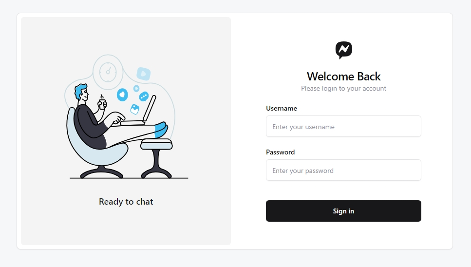
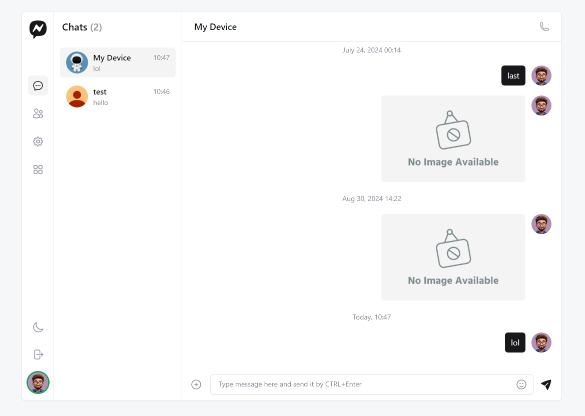
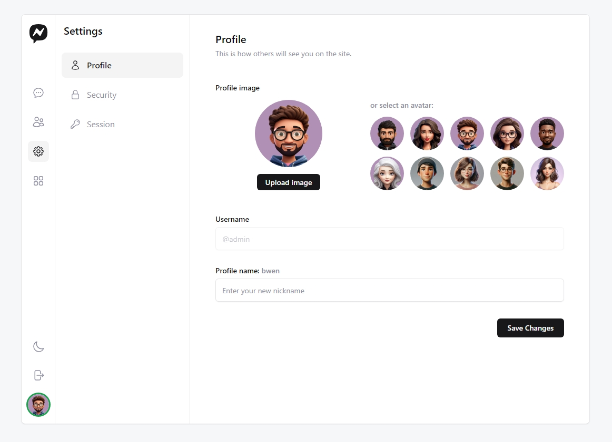

# Leptos-Web-Chatting

This repository demonstrates the use of the following crates:

* [Leptos](https://github.com/leptos-rs/leptos):
A full-stack, isomorphic Rust web framework leveraging fine-grained reactivity to build declarative user interfaces.

* [Cargo-Leptos](https://github.com/leptos-rs/cargo-leptos):
Build tool for Leptos.

* [Axum](https://github.com/tokio-rs/axum):
A web application framework that focuses on ergonomics and modularity.

* [Tokio](https://tokio.rs/):
Asynchronous runtime for the Rust programming language.

* [Sqlx](https://github.com/launchbadge/sqlx):
An async, pure Rust SQL crate featuring compile-time checked queries without a DSL.

* [Redis](https://redis.io/):
An in-memory database that persists on disk.

* [Wasm-Bindgen](https://github.com/rustwasm/wasm-bindgen):
Facilitating high-level interactions between Wasm modules and JavaScript.

* [Tailwindcss](https://tailwindcss.com/):
A utility-first CSS framework packed with classes like flex, pt-4, text-center and rotate-90 that can be composed to build any design, directly in your markup.

## Features
* User Authentication and Verification.
* Database Management CRUD and SQL Join Statements.
* Asynchronous api calls.
* Solidjs-like, fine grained reactive environment.
* Tailwind CSS compilation.

## Preview
### Login

### Chatting

### Setting


## Building
To build this repository within a container, simply run the following command within the root directory of this project in an environment where docker is installed:

```bash
docker build . -t bwen19/chat
```

Note that this building process involves compiling the release version of the project (heavily optimized) and **will** take upwards of 15-20 minutes to compile.

## Deploy
To run this project after compilation, run the following command:

```bash
docker compose up -d
```
